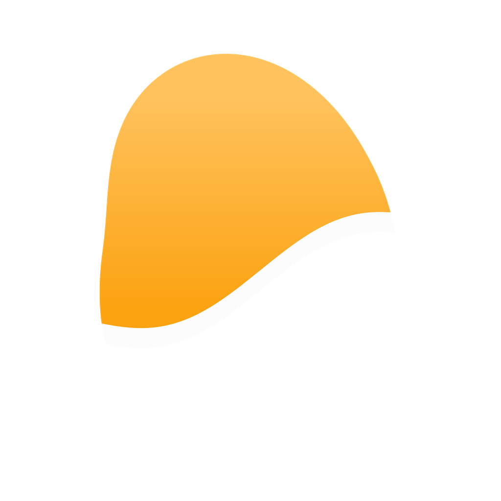
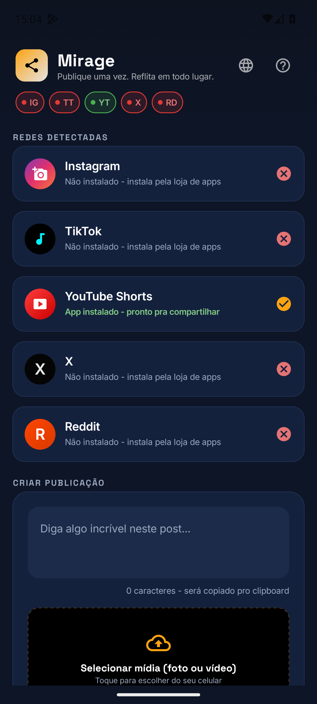
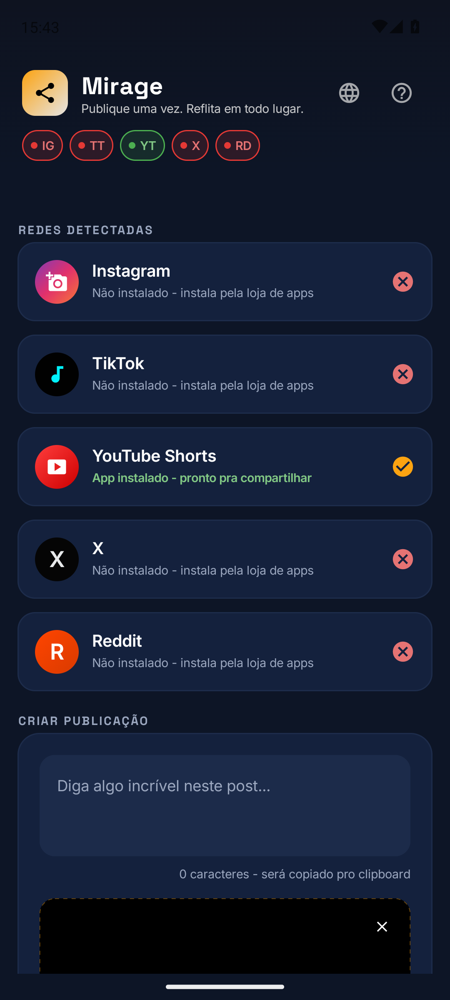
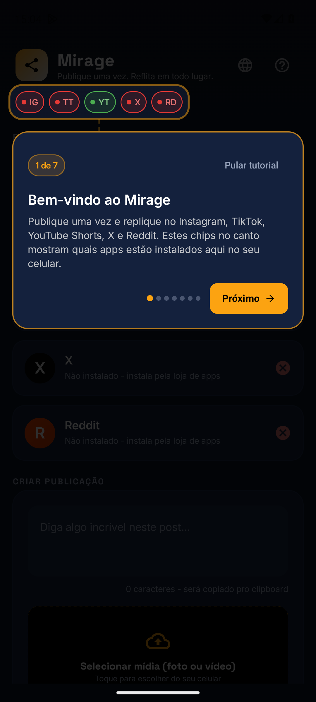
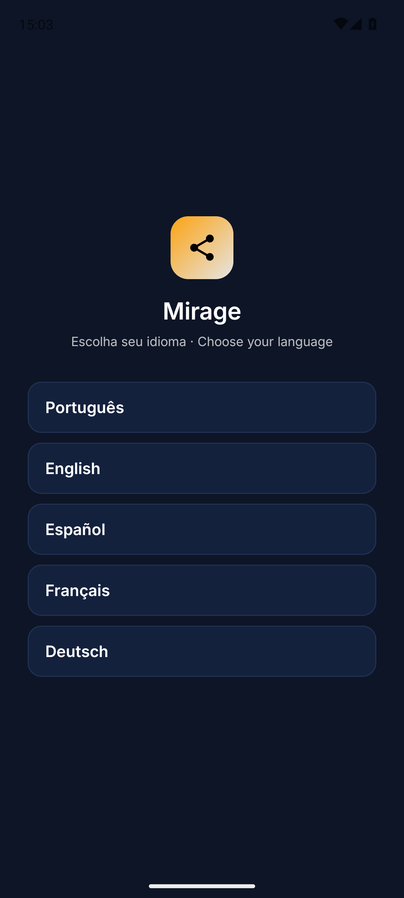

# Mirage

**Publique em todas as redes de uma vez.**

Um vídeo, uma legenda — Instagram, TikTok, Shorts, X e Reddit num só toque. Sem login, sem servidor, sem mensalidade.

---

Você gravou o vídeo uma vez. Por que postar cinco vezes?

O **Mirage** pega **um único vídeo + uma legenda** e reflete o mesmo conteúdo em **todas as suas redes** — Instagram, TikTok, YouTube Shorts, X e Reddit — direto do celular, num toque por rede. Nada de abrir cinco apps, copiar, colar, exportar de novo. Você faz uma vez; o Mirage espalha.

E o mais importante: **seu vídeo nunca sai do seu telefone**. O Mirage não tem servidor, não pede login das suas redes e não sobe nada pra nuvem de ninguém. Ele entrega o seu arquivo original pro app oficial de cada rede — do jeito que você postaria na mão, só que sem a mão.

## ✨ Por que você vai usar todo dia

- **Economiza horas de repost.** Editou o vídeo? Toca em *Compartilhar → Mirage* e ele já abre com a mídia carregada. Um fluxo, cinco redes.
- **Um toque por rede.** Legenda pronta, preview na tela, e você confirma cada publicação. Você no controle, sem robô postando às cegas.
- **Sem login, sem OAuth.** O Mirage nunca conecta suas contas a um terceiro. Menos risco de bloqueio, menos superfície de ataque, zero senha entregue.
- **Privacidade de verdade.** Não existe servidor Mirage. O vídeo vai do seu celular direto pro app da rede — sem re-upload, sem re-encode, **sem marca d'água de cross-post**.
- **Sem mensalidade.** Concorrentes cobram de R$ 25 a R$ 130 **por mês**. O Mirage é **compra única** — pagou, é seu.
- **Leve e nativo.** App Android nativo (Kotlin + Jetpack Compose), tema escuro, funciona offline. Nada de web pesada disfarçada de app.
- **Em 5 idiomas.** Português, English, Español, Français e Deutsch — a tela de escolha aparece na primeira abertura.

## ⚡ Como funciona

1. **Edite onde você já edita** — CapCut, galeria, câmera, o que for.
2. **Compartilhe pro Mirage** — ele abre com o vídeo e a legenda prontos.
3. **Escolha as redes** — marque Instagram, TikTok, Shorts, X, Reddit.
4. **Espelhe** — um toque por rede, com preview antes de publicar. Pronto.

Sem planilha de horários na cabeça, sem "deixei de postar no TikTok de novo". Grava uma vez, aparece em todo lugar.

## 💛 Planos

O Mirage é **compra única** — sem assinatura, sem cobrança recorrente, sem pegadinha. Pagou uma vez, é seu pra sempre.

| Plano | Preço | O que libera |
|---|---|---|
| **Essencial** | **R$ 29,90** | Espelhar pra **Instagram + TikTok** — as duas redes que mais importam pro vídeo curto. |
| **Completo** | **R$ 49,90** | **Todas as redes** (Instagram, TikTok, Shorts, X, Reddit) + recursos avançados: legenda por rede, presets salvos, ordem custom da fila e novas redes conforme chegam. |

> Enquanto os apps de agência cobram por mês, o Mirage cobra **uma vez**. Faça a conta: em dois meses de Buffer ou Repurpose você já pagou mais que o Mirage Completo — pra sempre.

## 📱 Telas

 

## 🚀 Experimente

O Mirage está **na Google Play** e você pode conhecer tudo agora:

➡️ **[mirage-social-app.web.app](https://mirage-social-app.web.app)**

Lá você vê o app em ação, entra pra lista de teste e é avisado quando sair na Play Store.

## 🥷 Mascote

Todo projeto do estúdio tem o **ninja Codex** na cor da sua identidade — o mesmo mascote da casa, recolorido pro tema do **Mirage**.

 

## 👤 Sobre o desenvolvedor

**Paulo Adriel** é produtor de vídeo e desenvolvedor indie brasileiro. Construo o produto **e** a apresentação dele — código + identidade visual, motion e material de lançamento — do zero ao ar em 30 dias. Trabalho de forma aberta e escuto quem usa. Estúdio [**Paulocodex**](https://paulocodex.com).

 

---

📧 [contato@paulocodex.com](mailto:contato@paulocodex.com) &nbsp;·&nbsp; 🌐 [paulocodex.com](https://paulocodex.com) &nbsp;·&nbsp; 📸 [Instagram](https://instagram.com/paulodev.codex) &nbsp;·&nbsp; 💼 [LinkedIn](https://www.linkedin.com/in/paulo-adriel/) &nbsp;·&nbsp; 🐙 [github.com/Paulothedeveloper](https://github.com/Paulothedeveloper)

_Repositório de **apresentação pública** — o código-fonte é fechado. Nada de dado ou segredo aqui._

